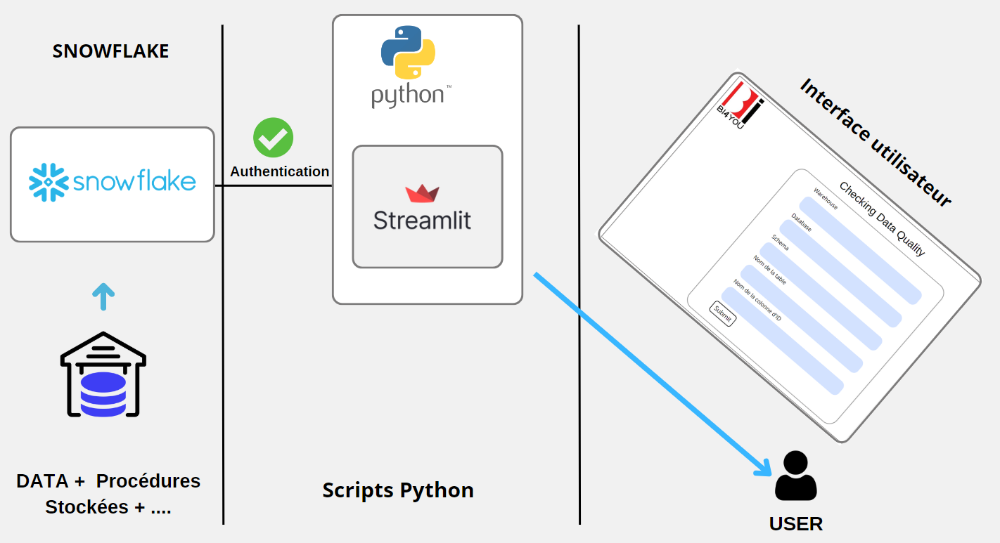
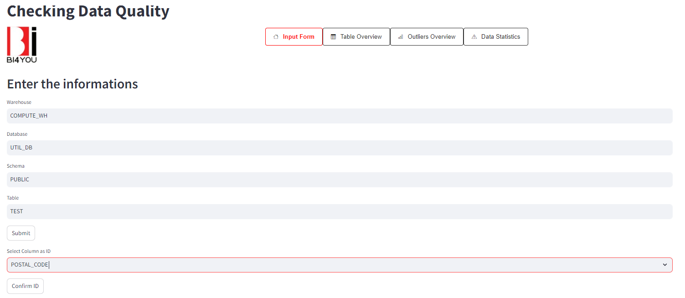
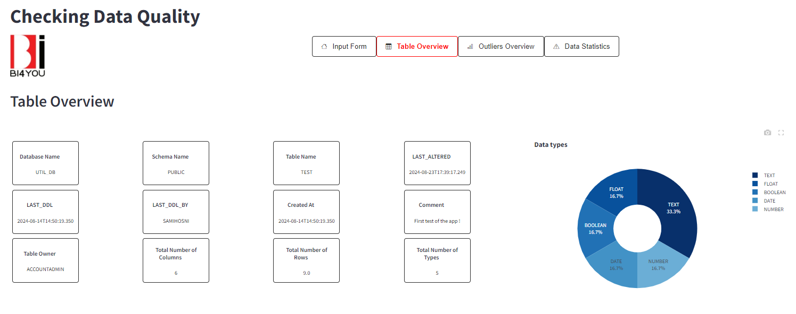
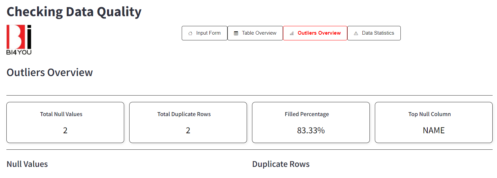
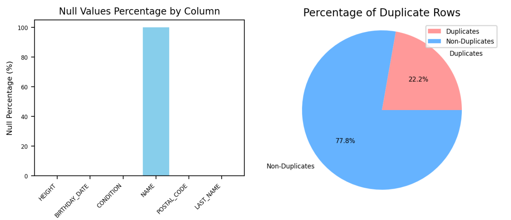
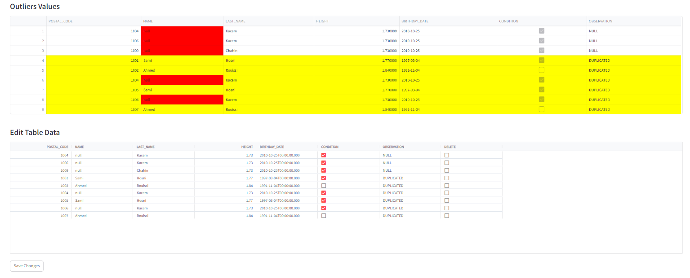
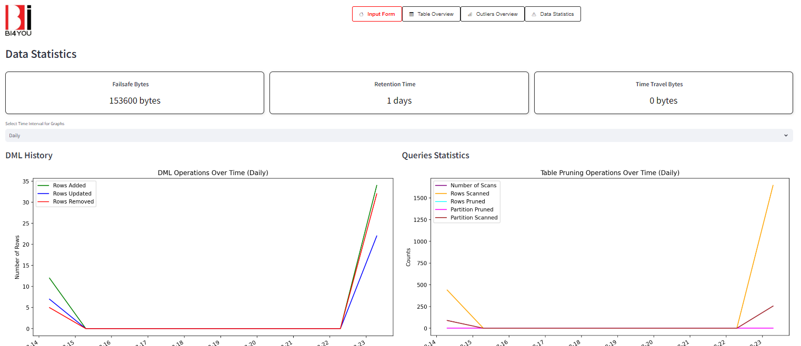
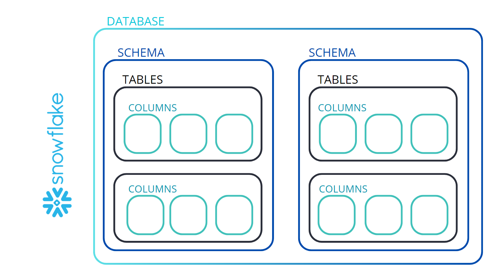
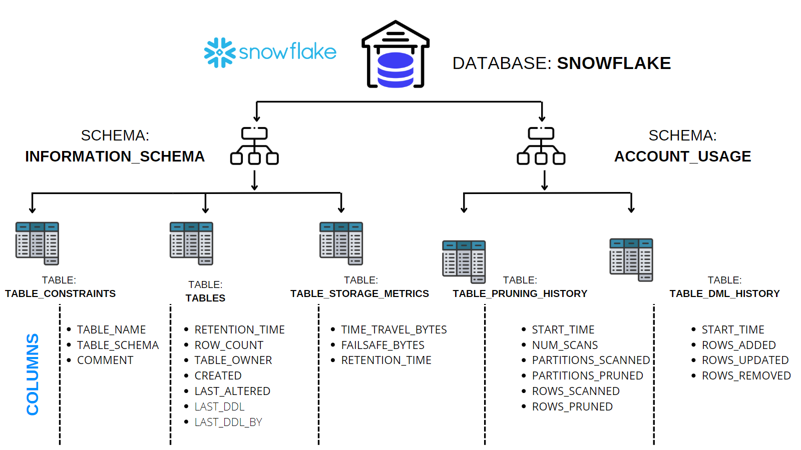

# Checking Data Quality

## Project Overview

This project focuses on developing an application to evaluate and ensure the quality of data within a Snowflake environment. The application consists of two interactive dashboards and an interface dedicated to managing anomalous values. It automates data validation processes and provides insightful analytics, thereby facilitating more reliable decision-making.

### Author
**Sami El Hosni**

## Table of Contents

1. [Introduction](#introduction)
2. [Objectives](#objectives)
3. [Analysis of Existing Systems](#analysis-of-existing-systems)
    - [Evaluation of Current Tools](#evaluation-of-current-tools)
4. [Proposed Solution](#proposed-solution)
5. [System Architecture](#system-architecture)
6. [Prototype](#prototype)
    - [Table to Analyze](#table-to-analyze)
    - [Detailed Application](#detailed-application)
7. [Conclusion](#conclusion)

## Introduction

In today’s data-driven world, ensuring the quality of data is crucial for making informed strategic decisions. This project aims to create an application that evaluates and guarantees data quality within a Snowflake account. The application offers key features such as data quality assessment, tracking table changes over time, and an interface for modifying data when necessary.

## Objectives

The primary objectives of this project are:
1. **Clear Requirements**: Provide precise functional specifications to define and document the expected behavior of the system.
2. **User Alignment**: Capture specific user requirements to ensure the system meets their needs.
3. **Development Support**: Guide developers in implementing the required features and serve as a reference for testing.
4. **System Design Foundation**: Establish a solid foundation for designing a system architecture that meets the specified requirements.
5. **Change Management**: Provide a reference for evaluating the impact of proposed changes and ensuring alignment with the initial objectives.

## Analysis of Existing Systems

### Evaluation of Current Tools

Currently, data quality assessment in Snowflake often requires manual intervention, which can be time-consuming and prone to human error. For example:
- Snowflake allows users to detect null values but does not automatically identify duplicate rows.
- Modifying or deleting null values and duplicates requires writing specific SQL queries instead of using an intuitive dashboard.
- Tracking table modifications over time is only possible through SELECT queries on VIEWS under `INFORMATION_SCHEMA` and `ACCOUNT_USAGE`, without a clear dashboard for easy monitoring.

## Proposed Solution

To optimize data evaluation in Snowflake and automate validation processes, the proposed solution involves developing an integrated application using Python and Streamlit. This solution includes two interactive dashboards and an interface for managing anomalous values.

### Dashboard 1: Table Characteristics

This dashboard provides detailed information about each table in Snowflake, such as:
- Database and Schema Names
- Last DDL Modification Date and User
- Table Owner and Creation Date
- Total Rows and Columns
- Data Types in the Table

### Dashboard 2: Data Statistics and Analysis

This dashboard offers in-depth statistics and performance analysis, including:
- Failsafe Bytes Usage
- Data Retention Time
- Time Travel Availability
- Historical DML and Query Operation Graphs

### Anomalous Value Management Interface

This interface allows users to identify, examine, and modify anomalous values, such as duplicates and null values, directly through the dashboard.

## System Architecture

The system architecture consists of three main components:
- **Snowflake**: Serves as the primary data source.
- **Python Scripts**: Perform data analysis using the Streamlit library.
- **User Interface**: Displays interactive dashboards and allows data modifications.

## Prototype

### Table to Analyze

The prototype includes an initial interface for users to input the necessary table information.

### Detailed Application

#### Dashboard 1: Table Characteristics

#### Interface: Anomalous Value Management
#### Part 1:

#### Part 2:

#### Part 3:

The interface allows users to manage numeric and string-based null values and provides options for handling duplicate rows.
You only must modify a value or check delete for the row that you want to delete and FINALLY click Save Changes to confirm modifications.

#### Dashboard 2: Data Statistics and Analysis

## Conclusion

This interactive dashboard offers a comprehensive solution for evaluating and managing data quality in Snowflake. By integrating duplicate detection, null value handling, and data visualization tools, it significantly enhances the efficiency of data quality management.

## Source of metrics and variables (SNOWFLAKE)
### Organization in Snowflake

______________________________ 
### Used metrics and variables

# Getting Started 🚀
## Installing
* Download or clone the repository
* Create a fresh virtual environment
        
          python -m venv <name_of_the_venv>  
* Activate the virtual environment

           <name_of_the_venv>\Scripts\activate
* Install Required Libraries

            pip install -r requirements.txt
* Setup Environment Variables
* Create a .env file in the root directory and add your Snowflake credentials:

            USER=your_username
            PASSWORD=your_password
            ACCOUNT=your_account

## Executing
* RUN with : 

        streamlit run app.py

## HELP 
Contact me for any question or help 
*  📧 :samy.hosni@gmail.com
* Linkedin : https://www.linkedin.com/in/hosni-sami/

